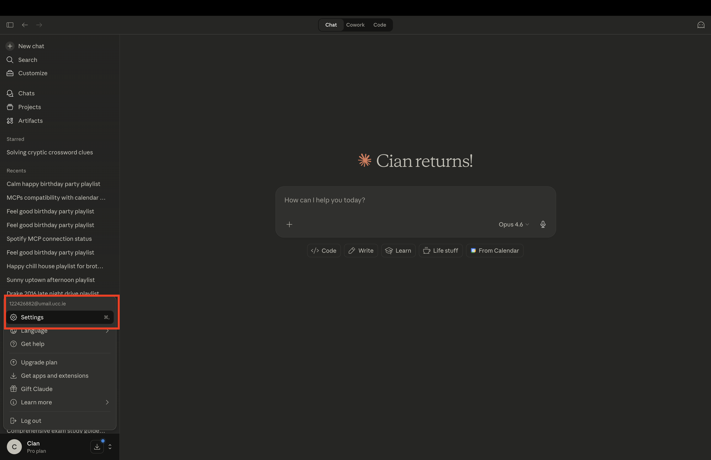
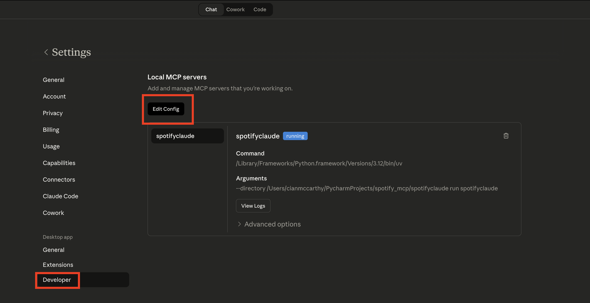
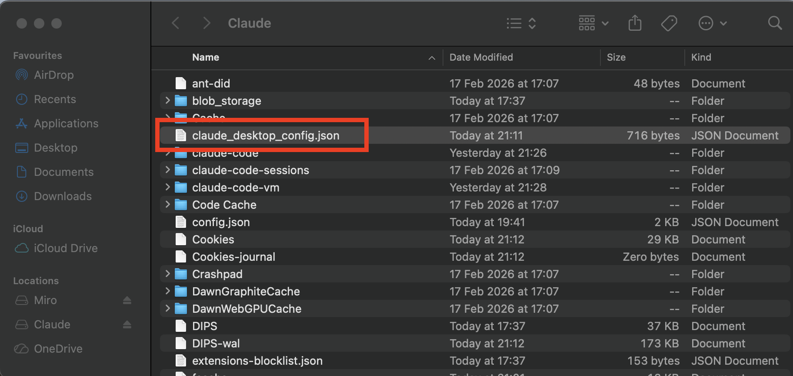
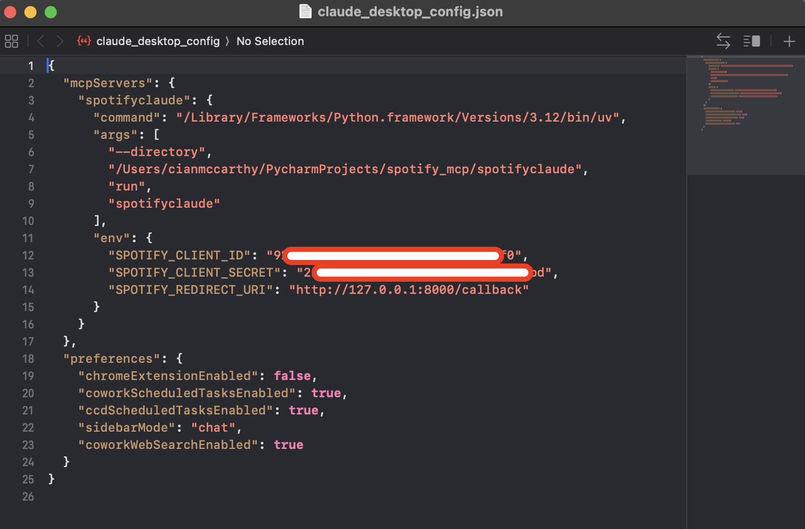
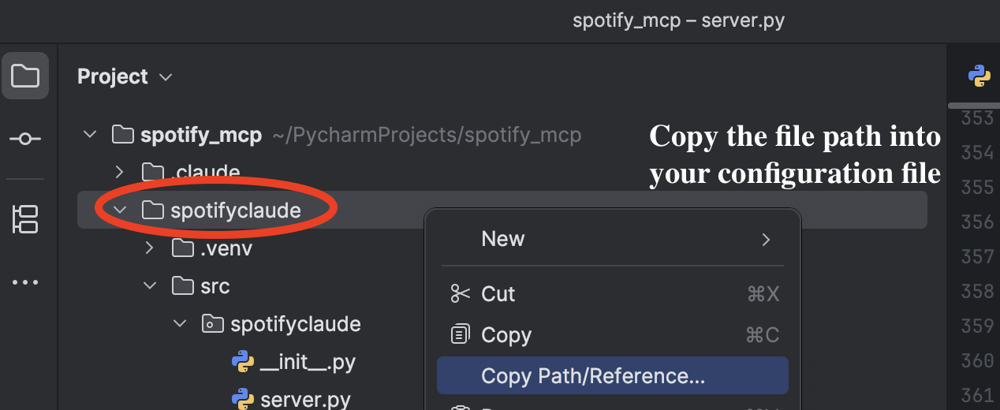
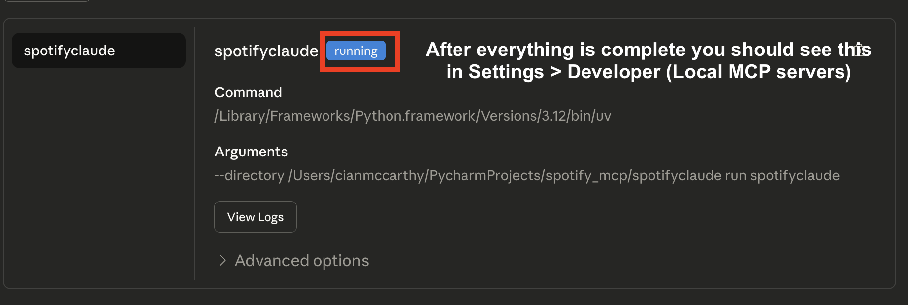
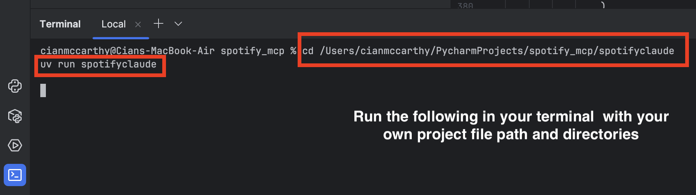

# Spotify MCP Server

A [Model Context Protocol](https://modelcontextprotocol.io) server that connects Claude to your Spotify account. Built for the **Claude Builders Club @ UCC**.

It exposes Spotify actions as tools Claude can call directly — search for tracks, see what's playing, create playlists, and add songs to them, all through conversation.

---

## Try It Yourself First

Before diving into this repo, we recommend scaffolding a blank MCP server yourself. It only takes a minute and gives you a feel for how the project is structured.

**Step 1 — Install uv** (a fast Python package manager):

```bash
pip install uv
```

**Step 2 — Install and run the MCP server creator** ([docs here](https://github.com/modelcontextprotocol/create-python-server?tab=readme-ov-file#using-pip)):

```bash
pip install create-mcp-server
create-mcp-server
```

It will walk you through naming your project. When it's done, you'll have a blank server with this structure:

```
spotifyclaude/
├── README.md
├── pyproject.toml
├── uv.lock
├── .python-version
└── src/
    └── spotifyclaude/
        ├── __init__.py
        └── server.py
```

All your logic lives in `server.py`. The rest is configuration.

---

## Now Build the Spotify Server

Once you have your blank server, try building the Spotify integration yourself before looking at the code. Here are the five tools you need to implement — use these as your spec:

- **`authorize`** — Run the Spotify OAuth flow in the browser, exchange the code for an access token, and save it to disk for reuse.
- **`get_current_song`** — Call the Spotify API to get the currently playing track and return the name, artist, album, and URL.
- **`search_track`** — Search the Spotify catalogue by query string and return the top results with their track URIs.
- **`create_playlist`** — Create a new private playlist on the user's account and return its URL.
- **`add_tracks`** — Take a playlist ID and a list of track URIs and add them to the playlist.

Stuck or want to see how we did it? The full implementation is below.

---

## Tools

| Tool | Description |
|---|---|
| `authorize` | Connect your Spotify account via OAuth. Run this first. |
| `get_current_song` | See what's currently playing. |
| `search_track` | Search the Spotify catalogue by name or artist. Returns URIs for use with `add_tracks`. |
| `create_playlist` | Create a new private playlist on your account. |
| `add_tracks` | Add one or more tracks to a playlist by URI. |

---

## Prerequisites

- [uv](https://docs.astral.sh/uv/getting-started/installation/) — Python package manager
- A [Spotify Developer](https://developer.spotify.com/dashboard) account with an app created
- [Claude Desktop](https://claude.ai/download)

---

## Full Setup Guide

### 1. Clone the repo (if struggling)

```bash
git clone https://github.com/CianMcCarthyUCC/Spotify-Model-Context-Protocol-Tutorial-Claude-Builders-Club-UCC.git
cd Spotify-Model-Context-Protocol-Tutorial-Claude-Builders-Club-UCC/spotifyclaude
```

### 2. Create a Spotify app

1. Go to the [Spotify Developer Dashboard](https://developer.spotify.com/dashboard) and create an app.
2. Add `http://127.0.0.1:8000/callback` as a **Redirect URI** in your app settings.
3. Copy your **Client ID** and **Client Secret**.
4. Add your Spotify account email under **User Management** (required while the app is in Development Mode).

### 3. Connect to Claude Desktop

Once you've built your tools (with a little help from Claude), you're ready to plug the server into Claude Desktop and try it for real.

Open Claude Desktop and go to **Settings** (bottom left of the sidebar):



Navigate to **Developer** → **Edit Config**. You'll also be able to see your server listed here once it's connected:



This opens the `claude_desktop_config.json` file. On **macOS** you'll find it at:

`~/Library/Application Support/Claude/claude_desktop_config.json`



Add the following to your config, replacing the `--directory` path with the location of your `spotifyclaude` folder:



```json
{
  "mcpServers": {
    "spotifyclaude": {
      "command": "/Library/Frameworks/Python.framework/Versions/3.12/bin/uv",
      "args": [
        "--directory",
        "/path/to/spotifyclaude",
        "run",
        "spotifyclaude"
      ],
      "env": {
        "SPOTIFY_CLIENT_ID": "your_client_id",
        "SPOTIFY_CLIENT_SECRET": "your_client_secret",
        "SPOTIFY_REDIRECT_URI": "http://127.0.0.1:8000/callback"
      }
    }
  }
}
```

To get the correct path, right-click the `spotifyclaude` folder in PyCharm and select **Copy Path/Reference...**:



Restart Claude Desktop. If everything is configured correctly, you should see `spotifyclaude` with a **running** badge under Settings → Developer → Local MCP servers:



Before authorizing, you can verify the server runs correctly by opening your terminal, navigating to your `spotifyclaude` folder, and running:

```bash
cd /path/to/your/spotifyclaude
uv run spotifyclaude
```



### 4. Authorize

In Claude, ask it to run the `authorize` tool. A browser window will open — log in with your Spotify account. Once you see "Success!", you're connected.

---

## Usage

Once authorized, just talk to Claude:

> *"What song is playing right now?"*
> *"Search for Daft Punk — One More Time"*
> *"Create a playlist called Saturday Morning Vibes"*
> *"Add that track to my playlist"*

---

## Debugging

Use the [MCP Inspector](https://github.com/modelcontextprotocol/inspector) to test tools without Claude Desktop:

```bash
npx @modelcontextprotocol/inspector uv --directory /path/to/spotifyclaude run spotifyclaude
```

---

## Notes on Spotify's API

- This server uses `POST /me/playlists` and `POST /playlists/{id}/items` — updated endpoints required by Spotify's [February 2026 API changes](https://developer.spotify.com/documentation/web-api/tutorials/february-2026-migration-guide).
- Apps in Development Mode support up to 25 users added via the Developer Dashboard.

---

## Guardrails

Things we ran into building this that you will probably hit too.

**Playlist creation returns 403.** Spotify's February 2026 API update broke the `POST /users/{user_id}/playlists` endpoint for apps in Development Mode. The fix is to use `POST /me/playlists` instead, which creates the playlist on behalf of the currently authenticated user. This is already handled in the server code.

**Adding tracks returns 403 or 404.** The same update renamed the `POST /playlists/{id}/tracks` endpoint to `POST /playlists/{id}/items`. If you see errors when adding tracks, make sure you are hitting `/items` and not `/tracks`. This is already handled in the server code.

**OAuth succeeds but write operations still fail.** Spotify's Development Mode requires you to explicitly add each user's email address under User Management in the Developer Dashboard. Even if someone can log in fine, playlist creation and track additions will fail with a 403 until their account is added there. You can add up to 25 users.

---

## License

MIT
